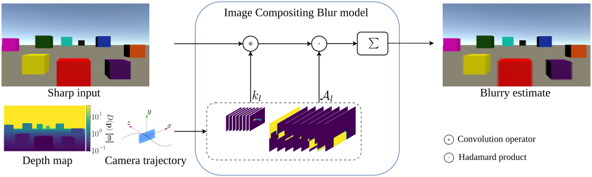

#  Depth-Aware Image Compositing Model for Parallax Camera Motion Blur

## [Project Page](https://germanftv.github.io/ParallaxICB.github.io/) | [Paper](https://link.springer.com/chapter/10.1007/978-3-031-31435-3_19) | [arXiv](https://arxiv.org/abs/2303.09334) 

[](https://germanftv.github.io/ParallaxICB.github.io/)
[](https://link.springer.com/chapter/10.1007/978-3-031-31435-3_19)
[](https://arxiv.org/abs/2303.09334)

### [German F. Torres](https://germanftv.github.io/) and [Joni Kämäräinen](https://webpages.tuni.fi/vision/public_pages/JoniKamarainen/index.html)

---

This is the official Pytorch implementation of the work: **"Depth-Aware Image Compositing Model for Parallax Camera Motion Blur"**.

> **Abstract:** *Camera motion introduces spatially varying blur due to the depth changes in the 3D world. This work investigates scene configurations where such blur is produced under parallax camera motion. We present a simple, yet accurate, Image Compositing Blur (ICB) model for depth-dependent spatially varying blur. The (forward) model produces realistic motion blur from a single image, depth map, and camera trajectory. Furthermore, we utilize the ICB model, combined with a coordinate-based MLP, to learn a sharp neural representation from the blurred input. Experimental results are reported for synthetic and real examples. The results verify that the ICB forward model is computationally efficient and produces realistic blur, despite the lack of occlusion information. Additionally, our method for restoring a sharp representation proves to be a competitive approach for the deblurring task.* 
<p align="center">
  
</p>


### Contents

1. [Getting Started](#getting-started)
2. [Testing](#testing)
3. [Citation](#citation)


---
## Getting Started

### 1. Installation
This repository is built in PyTorch 1.13.0 and tested on Ubuntu 20.04 environment (Python3.8, CUDA11.6). Follow these instructions:
* Clone repository
    ```
    git clone https://github.com/germanftv/ParallaxICB
    cd ParallaxICB
    ```
* Create conda environment
    ```
    conda create -y --name ParallaxICB python=3.8 && conda activate ParallaxICB
    ```
* Install dependencies
    ```
    sh install.sh
    ```

### 2. Datasets
Download and unzip datasets:
* [VirtualCMB](https://zenodo.org/record/7746117#.ZCUmCI5BxhE)
* [RealCMB](https://zenodo.org/record/7745713#.ZCUlvo5BxhE)

### 3. Configuration file: [`./configs/config.yaml`](./configs/config.yaml)
* Change the root directories ([VirtualCMB](/configs/config.yaml?plain=1L4) and [RealCMB](/configs/config.yaml?plain=1L11)) to the paths where the datasets have been downloaded. 
* Adjust [results directory](/configs/config.yaml?plain=1L17) to your own preference.

### 4. Info files
Run the following instruction to generate dataset info files:
```
python setup.py
```
> **Optional**:
> Download [pre-trained weights](https://drive.google.com/file/d/1igCJ58LdQnRQU4wJDqPfQQH0lmc38VLH/view?usp=share_link) of the sharp neural representations, unzip, and run `setup.py` for merging weights to results directory:
>```
>python setup.py --merge_ckpts $CKPT_DIR
>```
> where `$CKPT_DIR` is the unzipped directory with pre-trained weights.
---
## Testing
Blur formation (forward task) and neural sharp representation (inverse task) experiments can be run with the command:
```
python main.py $CMD --dataset $DATASET --model $BLUR_MODEL --id $ID
```
where:
* `$CMD` denotes the main command. Options: `blur` (forward task) or `deblur` (inverse task).
* `$DATASET` is the experimental dataset. Options: `RealCMB` or `VirtualCMB`.
* `$BLUR_MODEL` is the blur model to be tested. Options: `ICB` (proposed model) or `PWB` (baseline).
* `$ID` is the image id in the dataset info file. Options: `0`-`57` for RealCMB, or `0`-`982` for VirtualCMB.

For instance:
`python main.py blur --dataset RealCMB --model ICB --id 0
`
> **NOTE**:
> For reproducible deblurring results (PSNR, SSIM, LPIPS), use the option `--load_nn_model`. For instance:
>```
>python main.py deblur --dataset VirtualCMB --model ICB --id 0 --load_nn_model
>```
>Make sure to run, in advance, the **optional** step in our [Geeting Started](#getting-started).

---
## Summary report
A summary report for all the images in the corresponding dataset can be generated with the command:
```
python summary.py $CMD --dataset $DATASET --model $BLUR_MODEL 
```
where `$CMD`, `$DATASET`, and `$BLUR_MODEL` denote the same variables as in `main.py`

---
## Citation
If you find our work useful in your research, please cite:

    @inproceedings{torres2023parallaxicb,
        title={Depth-Aware Image Compositing Model for Parallax Camera Motion Blur},
        author={Torres, German F and K{\"a}m{\"a}r{\"a}inen, Joni},
        booktitle={Image Analysis: 23rd Scandinavian Conference, SCIA 2023, Sirkka, Finland, April 18--21, 2023, Proceedings, Part I},
        pages={279--296},
        year={2023},
        organization={Springer}
    }
